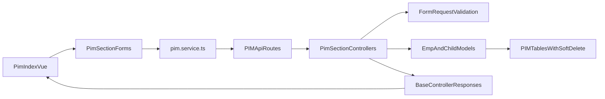

# Complete PIM Plan (Field-By-Field Parity)

## Goal

Build a full PIM module in `cosmichrm` that mirrors old app behavior from `MPc` (all tabs/fields/save flows), but implemented with current reusable Vue components and standardized backend patterns.

## Source Mapping (What must be mirrored)

- Old form source: [C:/xampp/htdocs/MPc/resources/views/PIM/index.blade.php](C:/xampp/htdocs/MPc/resources/views/PIM/index.blade.php)
- Old controller flow: [C:/xampp/htdocs/MPc/app/Http/Controllers/PIM/pimController.php](C:/xampp/htdocs/MPc/app/Http/Controllers/PIM/pimController.php)
- Old model/table set:
  - [C:/xampp/htdocs/MPc/app/Models/emp/Emp.php](C:/xampp/htdocs/MPc/app/Models/emp/Emp.php)
  - [C:/xampp/htdocs/MPc/database/migrations/2023_07_18_124940_create_emps_table.php](C:/xampp/htdocs/MPc/database/migrations/2023_07_18_124940_create_emps_table.php)
  - plus child migrations for contacts/education/training/language/employment/health/reference

## Reusable Components to use first (no custom duplication)

- Select replacement: [C:/xampp/htdocs/cosmichrm/resources/js/src/components/ui/Select2.vue](C:/xampp/htdocs/cosmichrm/resources/js/src/components/ui/Select2.vue)
- Table/list: [C:/xampp/htdocs/cosmichrm/resources/js/src/components/ui/DataTable.vue](C:/xampp/htdocs/cosmichrm/resources/js/src/components/ui/DataTable.vue)
- Row actions/spinner: [C:/xampp/htdocs/cosmichrm/resources/js/src/components/ui/ActionButtons.vue](C:/xampp/htdocs/cosmichrm/resources/js/src/components/ui/ActionButtons.vue)
- Save/Update/Cancel/Close buttons with spinner: [C:/xampp/htdocs/cosmichrm/resources/js/src/components/ui/AppButton.vue](C:/xampp/htdocs/cosmichrm/resources/js/src/components/ui/AppButton.vue)
- Image upload/crop: [C:/xampp/htdocs/cosmichrm/resources/js/src/components/ui/ImageCropUpload.vue](C:/xampp/htdocs/cosmichrm/resources/js/src/components/ui/ImageCropUpload.vue)

## Functional Scope (exact parity sections)

Implement all sections from old app in this order:

1. General
2. Service
3. Salary
4. Contacts
5. Education
6. Training
7. Language
8. Employment
9. Health
10. Reference

Each section supports:

- create/update save
- edit existing records
- row actions with spinner where applicable
- no-change detection for form state
- field-level + section-level validation

## Backend Plan

- Create sectioned controllers under `app/Http/Controllers/PIM/` and ensure all extend BaseController:
  - `PimGeneralController`
  - `PimServiceController`
  - `PimSalaryController`
  - `PimContactController`
  - `PimEducationController`
  - `PimTrainingController`
  - `PimLanguageController`
  - `PimEmploymentController`
  - `PimHealthController`
  - `PimReferenceController`
- Add FormRequest classes per section for validation.
- Add/align models under `app/Models/Emp/` (or existing project naming standard) with fillable, relationships, and creator/updater trait behavior.
- Create/align migrations for all PIM tables with:
  - `softDeletes()`
  - `created_by`, `updated_by`
  - proper foreign keys to employee master
- Fix known old mismatches while preserving UI behavior:
  - employment `attachment` vs `attachments` naming (standardize one)
  - manager/hobu/cof data typing consistency
  - status type consistency
- Define unified API response shape only through BaseController success/error methods.

## Frontend Plan (Vue)

- Create page + section components:
  - `resources/js/src/views/pim/PimIndex.vue`
  - `resources/js/src/components/pim/sections/PimGeneralSection.vue`
  - `resources/js/src/components/pim/sections/PimServiceSection.vue`
  - `resources/js/src/components/pim/sections/PimSalarySection.vue`
  - `resources/js/src/components/pim/sections/PimContactSection.vue`
  - `resources/js/src/components/pim/sections/PimEducationSection.vue`
  - `resources/js/src/components/pim/sections/PimTrainingSection.vue`
  - `resources/js/src/components/pim/sections/PimLanguageSection.vue`
  - `resources/js/src/components/pim/sections/PimEmploymentSection.vue`
  - `resources/js/src/components/pim/sections/PimHealthSection.vue`
  - `resources/js/src/components/pim/sections/PimReferenceSection.vue`
- Use existing reusable components first:
  - all selects via `Select2.vue` (single/multiple/search/clear/async)
  - all action rows via `ActionButtons.vue` with loading states
  - all footer actions via `AppButton.vue`
  - image fields via `ImageCropUpload.vue`
- Create shared PIM composables/services:
  - `resources/js/src/services/pim.service.ts`
  - `resources/js/src/composables/pim/usePimFormState.ts`
  - `resources/js/src/composables/pim/usePimValidation.ts`
- Add router entries and permissions/menu integration for PIM pages.

## Select2 Parity Plan (old behavior -> new behavior)

- Company type -> dynamically fetch and populate company list.
- Service section dependent selects:
  - line manager / HoBU / COF / special users with searchable async lists.
- Multi-select parity:
  - `special_user[]` equivalent as `multiple` with chips + clear.
- Modal-safe dropdown behavior:
  - use teleported dropdown support already in `Select2.vue`.
- Apply consistent config across all PIM select controls:
  - placeholder, clearable, loading indicator, disabled state, empty-state message.

## Data + API Flow

## Testing and Verification Plan

- Backend:
  - request validation tests per section
  - create/update tests for master and child records
  - soft-delete behavior tests
  - response schema tests (success/error)
- Frontend:
  - section submit tests (valid/invalid/no-change)
  - Select2 dependent loading tests
  - row action spinner tests
  - save/update/cancel/close reusable button loading-state tests
- End-to-end:
  - create employee full PIM flow
  - edit existing employee all sections
  - salary history + distribution roundtrip

## Delivery Phases

1. DB + model foundation
2. API/controller + validation layer
3. PIM page skeleton + tabs + shared state
4. Section-by-section implementation (General -> Reference)
5. Select2 parity and dependent lookups
6. QA hardening + bug parity fixes
7. Documentation + handover checklist

