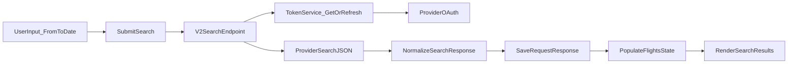

# Search V2 (No Pricing) Plan

## Goal
Deliver new search flow on `/flight-search` using JSON provider, excluding pricing logic for now.

## In-Scope
- UI on `/flight-search` matches current old search page behavior/layout.
- Token generation/auth flow for new provider.
- Search submit with `from -> to -> date` sends new API request.
- Search response saved in app state and persisted (for reload/debug/audit use).

## Out-of-Scope (This Phase)
- Pricing request flow (`PricingRequestBody` equivalent).
- Pricing UI blocks and pricing revalidation.

## Current Code Anchors
- Existing search UI/component: [C:/xampp/htdocs/BlueSky-vue-zo-nw/resources/js/components/search/searchResult.vue](C:/xampp/htdocs/BlueSky-vue-zo-nw/resources/js/components/search/searchResult.vue)
- Existing axios setup/interceptors: [C:/xampp/htdocs/BlueSky-vue-zo-nw/resources/js/axiosInstance.js](C:/xampp/htdocs/BlueSky-vue-zo-nw/resources/js/axiosInstance.js)
- Existing search API routes: [C:/xampp/htdocs/BlueSky-vue-zo-nw/routes/api.php](C:/xampp/htdocs/BlueSky-vue-zo-nw/routes/api.php)
- Existing API controller: [C:/xampp/htdocs/BlueSky-vue-zo-nw/app/Http/Controllers/Admin/API/APIController.php](C:/xampp/htdocs/BlueSky-vue-zo-nw/app/Http/Controllers/Admin/API/APIController.php)

## Execution Plan

### 1) Create isolated `search-v2` backend path
- Add dedicated route group for v2 search endpoints in [C:/xampp/htdocs/BlueSky-vue-zo-nw/routes/api.php](C:/xampp/htdocs/BlueSky-vue-zo-nw/routes/api.php).
- Add a new controller/service path (separate from legacy XML logic) to:
  - request OAuth token from Travelport auth endpoint,
  - execute search endpoint with bearer token,
  - return normalized JSON payload for UI.
- Keep legacy XML endpoints untouched.

### 2) Build token lifecycle module
- Implement token fetch (`grant_type=password`, username/password/client creds) via server-side config/env.
- Cache token with expiry buffer (reuse until near-expiry).
- Standardize error handling for token failure (401/timeout/provider error).

### 3) Build search request module (no pricing)
- Accept form payload from UI (`from`, `to`, date, trip type, pax fields currently used).
- Transform payload to provider JSON request shape.
- Execute search call with bearer token.
- Extract and normalize fields needed by current UI sections (non-pricing only).

### 4) Persist search response
- Save latest request+response snapshot (minimal schema) for page reuse and debugging.
- Store location:
  - frontend state (`flights`, metadata), and
  - optional backend log/table if requested by current architecture.
- Ensure safe persistence (mask token/secrets; no credential leak).

### 5) Frontend wire-up on existing page
- Keep current UI structure in [C:/xampp/htdocs/BlueSky-vue-zo-nw/resources/js/components/search/searchResult.vue](C:/xampp/htdocs/BlueSky-vue-zo-nw/resources/js/components/search/searchResult.vue).
- Replace only search call pipeline:
  - old `Lowfaresearch` call -> new v2 endpoint.
- Bind response save + render lifecycle:
  - search click -> loading -> save response -> populate list.
- Hide/disable pricing-trigger buttons/actions in this phase.

### 6) Verification checklist
- `/flight-search` loads with old-like UI intact.
- Form submit with from/to/date sends request successfully.
- Token generated/reused correctly across repeated searches.
- Response persists and re-populates state after refresh (if persistence enabled).
- Legacy search endpoints still functional (no regression).

## Data Flow (Phase Scope)

## Risks + Controls
- Token expiry race -> use expiry buffer + retry once on 401.
- Provider response mismatch -> strict mapper + null-safe defaults.
- UI regression -> keep template/CSS untouched; only swap API integration path.
- Secret exposure -> env-only credentials, never return secrets to frontend.

## Deliverables for this phase
- New v2 token + search backend endpoints.
- Updated `/flight-search` integration to v2 search (no pricing).
- Response save mechanism.
- Basic verification notes for token/search/save behavior.
